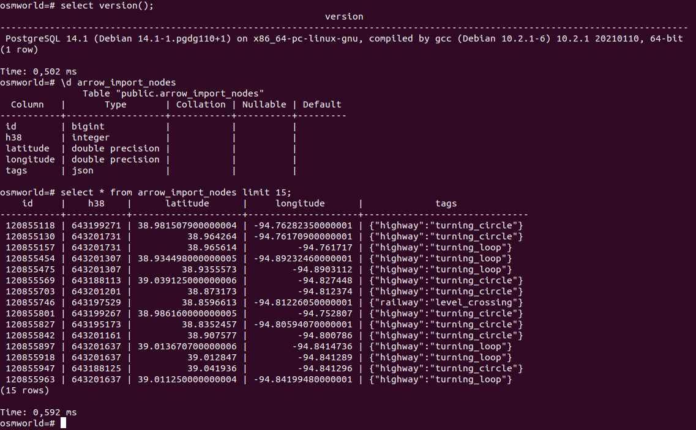

# Import data from Arrow Dataset API into relational DB via JDBC 

This CLI utility allow import data from file system in PARQUET and ARROW_IPC file format into relational database.
Apache Arrow dependencies and postgresql JDBC driver included in result executable jar file 

Build command:

    mvn package

Import utility usage:

    java -jar arrow_to_database-1.0-SNAPSHOT.jar --help

Options:

     -dataset
        file:// prefexed URI of Arrow dataset  
         https://arrow.apache.org/docs/python/dataset.html
     -dataset_format
        Dataset binary file format: PARQUET or ARROW_IPC
        Default: PARQUET
     -batch_size
        Batch size to fetch and sent into DB 
        https://arrow.apache.org/docs/python/dataset.html#customizing-the-batch-size 
        Default: 10000
     -db_dialect
        Database dialect for Arrow->DB type mapping: POSTGRESQL, H2, QUESTDB
        Default: POSTGRESQL
     -jdbc_driver
          Jdbc driver class name, provide only in case of 'No suitable driver
          found' issue. For example for H2 org.h2.Driver , for PostgreSQL
          org.postgresql.Driver
     -jdbc_url
          JDBC connection URL
     -username
          JDBC connection user name
     -password
          JDBC password. You can enter password in console interactive in case if not provide value after '-password' parameter  
     -table_name
        Table name to import dataset into it
         Default: arrow_import
     -create_table
        If parameter provided then create table in database before import. 
        'temporary' create temporary table - it can be useful for testing 
        purpose like dry run.     
     -insert_sql_query
        Custom SQL insert query

Parameters example:

    java -jar arrow_to_database-1.0-SNAPSHOT.jar -jdbc_url jdbc:postgresql://127.0.0.1:5432/osmworld -username postgres -dataset file:///home/build/dev/arrow/nodes -table_name arrow_import_nodes -create_table yes -password

